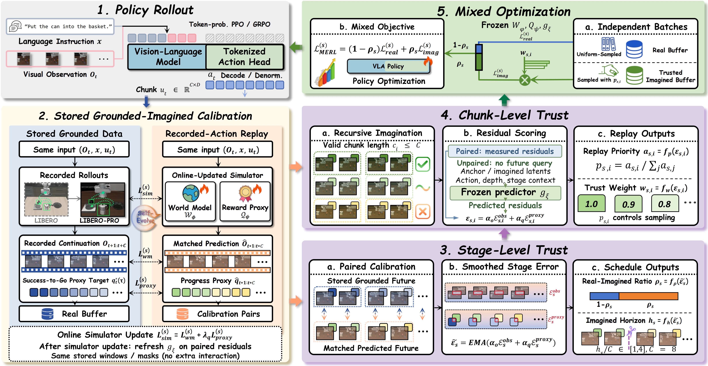

<div align="center">

# Trust-Calibrated VLA Policy Post-Training with Evolving Imagination

<p>
  Wenzhan Li<sup>1,2</sup> &nbsp; Yiran Qin<sup>3,4</sup> &nbsp; Heng Zhou<sup>4,5</sup><br>
  Huirui Wang<sup>1</sup> &nbsp; Yulan Guo<sup>1,2</sup> &nbsp; Ruimao Zhang<sup>1,&dagger;</sup>
</p>
<p>
  <sup>1</sup>Sun Yat-sen University &nbsp; <sup>2</sup>Shenzhen Loop Area Institute<br>
  <sup>3</sup>The Chinese University of Hong Kong, Shenzhen<br>
  <sup>4</sup>Shanghai AI Laboratory &nbsp; <sup>5</sup>University of Science and Technology of China
</p>
<p><sup>&dagger;</sup>Corresponding author: <a href="mailto:zhangrm27@mail.sysu.edu.cn">Ruimao Zhang</a></p>

<p>
  
  
  
  
  <a href="https://github.com/li-wenzhan/MERL"></a>
</p>
<p>
  <a href="#overview">Overview</a> &nbsp;|&nbsp;
  <a href="#method">Method</a> &nbsp;|&nbsp;
  <a href="#installation">Installation</a> &nbsp;|&nbsp;
  <a href="#training">Training</a> &nbsp;|&nbsp;
  <a href="#evaluation-and-visualization">Evaluation &amp; Visualization</a> &nbsp;|&nbsp;
  <a href="#citation">Citation</a>
</p>
</div>

**MERL couples VLA policy refinement with an evolving visual simulator and a grounded reward proxy. Stage-level reliability controls how much and how far to imagine; chunk-level trust controls which imagined experience contributes to policy optimization.**

## Overview

MERL uses grounded experience to improve both its policy and its simulator. It calibrates visual and progress errors on stored trajectories, then estimates the reliability of new imagined chunks with a frozen residual predictor. This supports recursive imagination as the policy changes, while concentrating policy updates on reliable experience.

The implementation combines tokenized **OpenVLA-OFT**, **Ctrl-World**, **LIBERO-PRO**, Ray and FSDP. This repository provides the training loop, component controls, evaluation, resumable checkpoints, and tools for robot videos and simulator comparisons.

## Method

<div align="center">
  
</div>

The five panels above describe each refinement stage:

1. **Policy rollout.** Collect six grounded trajectories with the current VLA policy. Decode and denormalize categorical tokens into 8-step, 7-dimensional action chunks; store the executed commands with their preceding and resulting RGB observations.
2. **Stored grounded-imagined calibration.** Update the world model and progress proxy on stored grounded windows. Replay the same recorded actions to obtain matched predictions and residual targets, then refresh the residual predictor. Calibration uses the stored observations and masks without additional environment interaction.
3. **Stage-level trust.** Smooth the measured visual and proxy errors to schedule the real–imagined mixture ratio and the imagination horizon, between 8 and 32 environment steps.
4. **Chunk-level trust.** Re-query the policy on predicted RGB observations to imagine recursively. The frozen predictor estimates visual and proxy residuals from the anchor, imagined latents, executed actions, rollout depth and stage context. These errors determine replay probabilities and detached trust weights; partial chunks retain explicit masks.
5. **Mixed optimization.** Sample real and imagined chunks independently, then optimize `(1 − ρ) L_real + ρ L_imag`. Categorical token losses are summed within each valid chunk; the two branches are normalized by their own chunk counts. The simulator, proxy and residual predictor stay frozen during this policy update.

| Mode | Simulator | Stage scheduling | Imagined chunk sampling / weighting | Policy data |
| :--- | :--- | :--- | :--- | :--- |
| `MFRL` | Disabled | — | — | Real |
| `MBRL` | Frozen | Fixed ratio / horizon | Uniform / unit weight | Real + imagined |
| `STATIC_TRUST` | Frozen | Calibrated | Trust priority / weight | Real + imagined |
| `ONLINE_MBRL` | Online updated | Fixed ratio / horizon | Uniform / unit weight | Real + imagined |
| `MERL` | Online updated | Calibrated | Trust priority / weight | Real + imagined |

All modes share the grounded budget, actor optimizer, action representation and evaluation interface. See [training details](docs/training.md) and [no-oracle trust](docs/no_oracle_trust.md).

## Installation

Use **Linux, Python 3.10, CUDA PyTorch/torchvision, NCCL, EGL and ffmpeg**. Policy training uses three actor GPUs; model-based modes add a fourth GPU for the shared simulator. A node with **4 × H100 80 GB** supports this layout. Simulator initialization and video comparison use one GPU.

```bash
python3.10 -m venv .venv
source .venv/bin/activate
# Install the CUDA PyTorch/torchvision pair for your host, then:
python -m pip install -r requirements.txt
```

[Runtime versions](configs/runtime_versions.json) and [runtime setup](docs/runtime.md) provide dependency and headless-rendering details. OpenVLA-OFT uses eager attention in this implementation.

Prepare the [LIBERO-PRO](https://github.com/Zxy-MLlab/LIBERO-PRO) checkout and local [SVD](https://huggingface.co/stabilityai/stable-video-diffusion-img2vid) and [CLIP](https://huggingface.co/openai/clip-vit-base-patch32) backbones before training:

```bash
export LIBERO_PRO_ROOT=/benchmark/LIBERO-PRO
export MERL_SVD_MODEL_PATH=/models/stable-video-diffusion-img2vid
export MERL_CLIP_MODEL_PATH=/models/clip-vit-base-patch32
export TORCH_HOME=/models/torch
# Cache the ImageNet initialization for the progress proxy during asset preparation.
python -c 'from torchvision.models import resnet18, ResNet18_Weights; resnet18(weights=ResNet18_Weights.DEFAULT)'
```

Online refinement collects its own experience. Demonstrations in RLDS format are needed when preparing the initial VLA policy; simulator initialization below uses locally collected trajectories. `configs/pretraining_config.yaml` selects the original tasks, while `configs/evaluation_config.yaml` selects environment perturbations. Prepare matching BDDL and initial-state assets for each selected panel.

## Training

Start a fresh training run with the following sequence. MERL policy checkpoints are generated locally by these commands.

### 1. Prepare the VLA initialization

Train a categorical action-chunk policy from the public OpenVLA base model using the [OpenVLA-OFT fine-tuning workflow](https://github.com/moojink/openvla-oft/blob/main/LIBERO.md). Select **discrete token prediction**, **one RGB image**, **no proprioception** and **8 × 7 actions**:

```text
--use_l1_regression False --use_diffusion False --use_film False
--num_images_in_input 1 --use_proprio False
```

A complete command and checkpoint preparation steps are in [the initialization guide](docs/training.md#vla-initialization). Export the merged model with its tokenizer, processor and `dataset_statistics.json`, then set:

```bash
export VLA_INIT=/outputs/vla_init/merged_model
export UNNORM_KEY=libero_10_no_noops
```

### 2. Collect simulator training trajectories

Collect real-environment trajectories with the initialized policy, without policy updates:

```bash
bash scripts/run_logged.sh python -m merl.launch \
  --mode MFRL --job collect --experiment wm_data_seed0 \
  --vla-init "$VLA_INIT" --unnorm-key "$UNNORM_KEY" \
  --eval-config configs/pretraining_config.yaml --actor-gpus 1 --trials 6 \
  --collection-dir data/wm_initialization --split wm_train
```

The NPZ files contain `T+1` RGB observations for `T` executed actions, task instructions and outcomes. Training and held-out evaluation collections use separate directories.

### 3. Train the initial simulator and proxy

Initialize from the public visual/text backbones and train on the collected trajectories:

```bash
CUDA_VISIBLE_DEVICES=0 bash scripts/run_logged.sh python -m merl.train_simulator \
  --data data/wm_initialization/wm_train/trajectories \
  --output outputs/wm_init/seed0 --steps 5000 --save-every 500 --seed 0
export WM_INIT="$PWD/outputs/wm_init/seed0/checkpoint-5000.pt"
```

The trainer saves model weights, optimizer and RNG state, trajectory hashes and loss curves. `--from-checkpoint` loads an existing simulator initialization; `--resume-from` restores a saved training state. See [simulator initialization](docs/training.md#simulator-initialization).

### 4. Run policy refinement

```bash
bash scripts/run_logged.sh python -m merl.launch \
  --mode MERL --stages 100 --seed 0 --experiment merl_seed0 \
  --vla-init "$VLA_INIT" --unnorm-key "$UNNORM_KEY" --wm-checkpoint "$WM_INIT"
```

Choose `MFRL`, `MBRL`, `STATIC_TRUST` or `ONLINE_MBRL` to run the component controls. MFRL requires only the VLA initialization. For comparisons, reuse the same initialization, task panel and seed schedule across modes.

Algorithm settings live in [configs/merl.json](configs/merl.json). Additional Hydra overrides follow `--`, for example:

```bash
# Disable chunk trust while retaining online evolution and stage scheduling.
python -m merl.launch --mode MERL --experiment no_chunk_seed0 \
  --vla-init "$VLA_INIT" --unnorm-key "$UNNORM_KEY" --wm-checkpoint "$WM_INIT" \
  -- merl.chunk_trust=false
```

Completed checkpoints restore policy, simulator, optimizer, RNG, trust state and replay sampling state. Resume into a fresh experiment directory with an absolute target stage count:

```bash
python -m merl.launch --mode MERL --experiment merl_seed0_resumed --stages 100 \
  --vla-init "$VLA_INIT" --unnorm-key "$UNNORM_KEY" --wm-checkpoint "$WM_INIT" \
  --resume-from checkpoints/MERL/merl_seed0/training_state/completed_stage_000050.pt
```

## Evaluation and visualization

### Closed-loop robot behavior

Evaluate the saved actor on real simulator environments and export episode videos, keyframes, trajectories and success metrics:

```bash
bash scripts/run_logged.sh python -m merl.launch \
  --mode MERL --job evaluate --experiment merl_eval_seed0 \
  --vla-init "$VLA_INIT" --unnorm-key "$UNNORM_KEY" \
  --actor-checkpoint checkpoints/MERL/merl_seed0/actor/global_step_100 \
  --actor-gpus 3 --trials 6
```

FSDP checkpoint evaluation uses the same actor rank count as training. To evaluate the initialized policy on one GPU, omit `--actor-checkpoint` and use `--actor-gpus 1`.

For a compact sequential comparison on one four-GPU node:

```bash
bash examples/run_presentation.sh \
  --modes MFRL MBRL ONLINE_MBRL MERL \
  --vla-init "$VLA_INIT" --unnorm-key "$UNNORM_KEY" --wm-checkpoint "$WM_INIT" \
  --tasks 0 --trials 3 --steps 6 --training-minutes 15 \
  --output outputs/comparison_seed0
```

The comparison runner saves every requested trial, side-by-side videos, contact sheets, `scores.png`, `summary.json` and `trials.csv`. Its evaluation states start at offset 10; each mode records its actual interactions, optimizer updates and elapsed time.

### World-model imagination

Compare checkpoints against the same held-out observations and recorded actions:

```bash
bash scripts/run_logged.sh python -m merl.wm_visual_compare \
  --episode /outputs/heldout/episode.json \
  --checkpoint MBRL="$WM_INIT" \
  --checkpoint ONLINE_MBRL=/outputs/online/world_model/global_step_5/world_model.pth \
  --checkpoint MERL=/outputs/merl/world_model/global_step_5/world_model.pth \
  --start 64 --horizon 32 --inference-steps 8 --rollout recursive \
  --output outputs/wm_comparison_seed0
```

Outputs include GT and predicted videos, image panels, proxy traces, pixel MSE/PSNR and checkpoint/reference hashes. Models load sequentially on one GPU. Recursive prediction conditions on past and predicted RGB; `--rollout teacher_forced` provides a one-chunk diagnostic using stored real history. [Visualization guide](docs/visualization.md).

## Results

Component comparison averaged over four perturbed task suites:

| Method | Average SR ↑ | AUC ↑ | S2T-H ↓ |
| :--- | ---: | ---: | ---: |
| MFRL | 77.2 | 67.9 | 103.4 |
| Static-MBRL | 73.3 | 59.8 | 168.9 |
| Static-MBRL + Trust | 75.1 | 63.5 | 145.8 |
| Online-Updated MBRL | 76.2 | 65.4 | 139.6 |
| MERL | **79.7** | **70.6** | **92.1** |

SR measures task success; AUC summarizes the success-rate learning curve; S2T-H counts refinement stages to the target success threshold with interpolated crossings. Each stage allows six grounded trajectories and at most 3,072 environment transitions.

## Experiment outputs

Each experiment records its resolved configuration, input assets, source hashes, package versions, devices, command and final status. Stage logs include interaction counts, trust decisions, gradient norms and timings. Checkpoints and rollout artifacts are organized under `checkpoints/<MODE>/<EXPERIMENT>/`.

`scripts/run_logged.sh` streams stdout/stderr to the terminal and saves logs under `tmp_files/acp_logs/`, with exit codes and elapsed time in a matching `.status.json`. Set `ACP_LOG_DIR` to choose another persistent location.

```bash
python -m unittest discover -s tests -v
```

## Repository guide

| Path | Purpose |
| :--- | :--- |
| `merl/algorithm.py`, `merl/trainer.py` | Configuration, objectives and refinement stages |
| `merl/simulator.py`, `merl/imagined_rollout.py` | Simulator adaptation and recursive policy imagination |
| `merl/trust.py`, `merl/stored_calibration.py` | Residual prediction and stage/chunk trust |
| `merl/train_simulator.py` | Initial simulator and proxy training |
| `merl/launch.py`, `configs/` | Training, evaluation, collection and runtime configuration |
| `verl/workers/` | Distributed actors and shared simulator worker |
| `modules/ctrl_world/` | Video predictor and progress classifier |
| `real_world/` | Robot-video prediction and HDF5 simulator training |
| `examples/`, `scripts/` | Run wrappers, logging, asset preparation and analysis |
| `tests/`, `docs/` | Contract tests and usage guides |

## Citation

```bibtex
@inproceedings{li2026merl,
  title     = {Trust-Calibrated VLA Policy Post-Training with Evolving Imagination},
  author    = {Li, Wenzhan and Qin, Yiran and Zhou, Heng and Wang, Huirui and Guo, Yulan and Zhang, Ruimao},
  booktitle = {Conference on Robot Learning},
  year      = {2026}
}
```

## Acknowledgments

MERL builds on VLA-RL, OpenVLA-OFT, Ctrl-World, LIBERO-PRO, Ray and PyTorch. We thank their authors and retain the original notices in vendored source. Refer to each upstream project's terms for its code, datasets and model weights.
