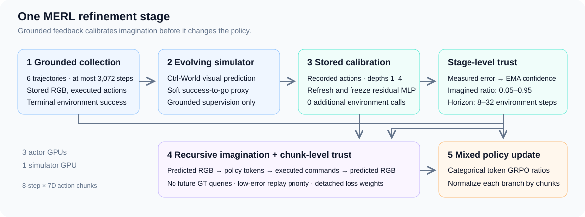

<div align="center">

# MERL
### Trust-Calibrated VLA Policy Post-Training with Evolving Imagination

<p>
  Wenzhan Li<sup>1,2</sup> &nbsp; Yiran Qin<sup>3,4</sup> &nbsp; Heng Zhou<sup>4,5</sup><br>
  Huirui Wang<sup>1</sup> &nbsp; Yulan Guo<sup>1,2</sup> &nbsp; Ruimao Zhang<sup>1,&dagger;</sup>
</p>
<p>
  <sup>1</sup>Sun Yat-sen University &nbsp; <sup>2</sup>Shenzhen Loop Area Institute<br>
  <sup>3</sup>The Chinese University of Hong Kong, Shenzhen<br>
  <sup>4</sup>Shanghai AI Laboratory &nbsp; <sup>5</sup>University of Science and Technology of China
</p>
<p><sup>&dagger;</sup>Corresponding author: <a href="mailto:zhangrm27@mail.sysu.edu.cn">Ruimao Zhang</a></p>

<p>
  
  
  
  
  <a href="https://github.com/li-wenzhan/MERL"></a>
</p>
<p>
  <a href="#overview">Overview</a> &nbsp;|&nbsp;
  <a href="#method">Method</a> &nbsp;|&nbsp;
  <a href="#installation">Installation</a> &nbsp;|&nbsp;
  <a href="#training">Training</a> &nbsp;|&nbsp;
  <a href="#evaluation-and-visualization">Evaluation &amp; Visualization</a> &nbsp;|&nbsp;
  <a href="#citation">Citation</a>
</p>
</div>

**MERL couples VLA policy refinement with an evolving visual simulator and a grounded reward proxy. Stage-level reliability controls how much and how far to imagine; chunk-level trust controls which imagined experience contributes to policy optimization.**

## Overview

An online-updated simulator can still produce unreliable futures as the policy changes. MERL calibrates that uncertainty on stored grounded experience and uses a frozen residual predictor to score recursive imagination without querying future environment states.

This release contains MERL and its component controls, built around tokenized **OpenVLA-OFT**, **Ctrl-World**, **LIBERO-PRO**, Ray and FSDP. The default `camera-ready` protocol follows the final paper's mechanism and data contracts. `--protocol legacy` retains earlier debugging workflows for inspecting historical artifacts.

**Implementation and reproduced results are separate.** This release implements the final-paper lifecycle. Original experiment checkpoints and complete original hyperparameter records are not bundled; the paper's numerical results have not been reproduced with this release. See the [implementation audit](docs/implementation_audit.md) for verified behavior, explicit engineering defaults and remaining runtime gates.

## Method

<div align="center">
  
</div>

Each refinement stage follows five steps:

1. **Collect grounded experience:** six current-policy trajectories, each capped at 512 executed actions. Store `T+1` observations for `T` actions, including the executed gripper convention.
2. **Update the simulator:** train the visual world model and soft binary reward proxy on grounded data. The proxy estimates truncated success-to-go from the observation **before** an action.
3. **Calibrate from stored windows:** replay exact recorded actions for depths 1–4; no extra environment interaction. Refresh and freeze the residual predictor, then schedule the mixture ratio and horizon from measured reliability.
4. **Imagine recursively:** query the policy on the latest predicted RGB observation. Score candidates using predicted residuals, sample low-error chunks preferentially, and apply detached trust weights.
5. **Refine the policy:** compute categorical action-token ratios; sum valid token losses within each chunk and normalize real and imagined branches independently by chunk count.

The implementation uses 8-step, 7-dimensional action chunks and imagination horizons of 8–32 **environment steps**. Partial final chunks retain explicit masks. Simulator updates/calibration precede imagination; the simulator and residual predictor remain frozen during the policy update.

| Mode | Simulator | Stage scheduling | Chunk replay / weighting | Policy data |
| :--- | :--- | :--- | :--- | :--- |
| `MFRL` | Disabled | Disabled | Uniform real chunks | Real |
| `MBRL` | Frozen | Fixed ratio / horizon | Uniform / unit weight | Real + imagined |
| `STATIC_TRUST` | Frozen | Calibrated | Trust priority / weight | Real + imagined |
| `ONLINE_MBRL` | Online updated | Fixed ratio / horizon | Uniform / unit weight | Real + imagined |
| `MERL` | Online updated | Calibrated | Trust priority / weight | Real + imagined |

All controls share the grounded allowance, actor optimizer, action interface and evaluation path. These controls are not renamed implementations of external algorithms. Details and equation-to-code pointers: [camera-ready protocol](docs/camera_ready_protocol.md) and [no-oracle trust](docs/no_oracle_trust.md).

## Installation

Use **Linux, Python 3.10, a compatible CUDA PyTorch/torchvision pair, NCCL, headless EGL and ffmpeg**. The reference allocation is one node with **4 × H100 80 GB**: three actor GPUs and one simulator GPU. MFRL uses the same three actor GPUs. Evaluation and stored-action WM visualization can use one GPU.

```bash
python3.10 -m venv .venv
source .venv/bin/activate
# Install a matching CUDA PyTorch/torchvision build for your host first.
python -m pip install -r requirements.txt
```

The development environment snapshot is in [configs/tested_runtime.json](configs/tested_runtime.json). It records an existing validated environment; it is not a complete dependency lock or a claim that every CUDA build has been tested. OpenVLA-OFT uses eager attention in this repository; FlashAttention is optional for other backbones.

Prepare these **local** assets before running an offline job:

| Asset | Required contents / configuration |
| :--- | :--- |
| OpenVLA-OFT SFT | Sharded model, tokenizer/processor, configuration and `dataset_statistics.json`; pass `--sft-checkpoint` |
| Ctrl-World | Complete trained simulator state; pass `--wm-checkpoint` for model-based training |
| SVD backbone | Local Stable Video Diffusion directory; set `MERL_SVD_MODEL_PATH` |
| CLIP backbone | Local CLIP directory; set `MERL_CLIP_MODEL_PATH` |
| [LIBERO-PRO](https://github.com/Zxy-MLlab/LIBERO-PRO) | Checkout, robot assets, selected BDDL tasks and matching initial states; set `LIBERO_PRO_ROOT` |

```bash
export LIBERO_PRO_ROOT=/benchmark/LIBERO-PRO
export MERL_SVD_MODEL_PATH=/models/stable-video-diffusion-img2vid
export MERL_CLIP_MODEL_PATH=/models/clip-vit-base-patch32
export SFT_CHECKPOINT=/models/openvla-oft
export WM_CHECKPOINT=/models/ctrl-world.pt
```

`configs/evaluation_config.yaml` selects perturbations. Its default environment-shift panel requires prepared `libero_10_env` BDDL/init assets. Empty `libero_pro_root` uses `LIBERO_PRO_ROOT`. Freeze and reuse task/state files across methods; a directory name alone does not establish a meaningful distribution shift.

**Online post-training from pretrained weights does not require demonstration HDF5 datasets.** Demonstrations are needed for SFT, offline simulator pretraining or physical-robot fixed-data adaptation. Held-out WM evaluation trajectories are collected separately and must never enter training/calibration.

## Training

Use the same entrypoint for all five modes. An experiment name creates a **fresh** output directory; existing runs are never overwritten.

```bash
# Check assets and compose configuration on the development machine.
python -m merl.launch --mode MERL --experiment merl_assets \
  --sft-checkpoint "$SFT_CHECKPOINT" --wm-checkpoint "$WM_CHECKPOINT" --check

# Submit on a four-GPU node. No Git checks, downloads or package installs run here.
bash scripts/run_logged.sh python -m merl.launch \
  --mode MERL --stages 100 --seed 0 --experiment merl_seed0 \
  --sft-checkpoint "$SFT_CHECKPOINT" --wm-checkpoint "$WM_CHECKPOINT"
```

Select `--mode MFRL` without a WM checkpoint for the real-only control. Use `MBRL`, `STATIC_TRUST` or `ONLINE_MBRL` with the same initialization and task panel for the other controls. The paper reports approximately **35 hours for 100 stages** on its reference allocation; throughput of this release must be measured on your ACP node.

`configs/camera_ready.json` makes trust, calibration and batch choices explicit. Some values, including the residual MLP, pooling and fitting settings, are **engineering defaults where original records are unavailable**. Do not describe an untuned default run as an exact numerical reproduction. Extra Hydra overrides follow `--`:

```bash
# Mechanism ablation: keep evolution and stage scheduling, disable chunk trust.
python -m merl.launch --mode MERL --stages 100 --seed 0 \
  --experiment merl_no_chunk_trust \
  --sft-checkpoint "$SFT_CHECKPOINT" --wm-checkpoint "$WM_CHECKPOINT" \
  -- paper.chunk_trust=false
```

### Checkpoints and resume

Completed stages save actor shards, optimizer/scheduler state, RNGs, simulator state, residual predictor and stage EMA. Resume into a new experiment directory with the **same actor GPU layout and research configuration**:

```bash
python -m merl.launch --mode MERL --stages 100 --seed 0 \
  --experiment merl_seed0_resumed \
  --sft-checkpoint "$SFT_CHECKPOINT" --wm-checkpoint "$WM_CHECKPOINT" \
  --resume-from checkpoints/MERL/merl_seed0/paper_state/completed_stage_000050.pt
```

Only a published `completed_stage_*.pt` is resumable as a completed stage. Mid-stage resume is not supported. Actor checkpoints use FSDP sharded state; optimizer restoration requires the original rank count. GPU kernels and distributed scheduling can still introduce numerical nondeterminism.

The default retains the latest two completed checkpoints created in the fresh run. `--checkpoint-keep 0` retains all. A resumed source run is never pruned. FP32 actor weights plus Adam moments alone occupy approximately 90 GB per saved stage; plan additional space for the simulator and the next checkpoint before retention runs.

## Evaluation and visualization

### Real-environment policy evaluation

Evaluate a saved actor against the same held-out task/state panel. `--sft-checkpoint` supplies the architecture, processor and action statistics; `--actor-checkpoint` supplies refined weights.

```bash
bash scripts/run_logged.sh python -m merl.launch \
  --mode MERL --job evaluate --experiment merl_eval \
  --sft-checkpoint "$SFT_CHECKPOINT" \
  --actor-checkpoint checkpoints/MERL/merl_seed0/actor/global_step_100 \
  --actor-gpus 3 --trials 6
```

For initial SFT evaluation, omit `--actor-checkpoint` and use `--actor-gpus 1`. Greedy evaluation uses real environment success and a 512-action limit. Saved episodes contain MP4s, unaltered PNG keyframes, outcome metadata and lossless aligned `trajectory.npz`. Invalid episodes remain visible and cannot count as successful trials.

### Short comparative run

```bash
bash examples/run_presentation.sh --modes MFRL MBRL ONLINE_MBRL MERL \
  --sft-checkpoint "$SFT_CHECKPOINT" --wm-checkpoint "$WM_CHECKPOINT" \
  --steps 6 --training-minutes 15
```

This sequential **exploratory** run uses shorter simulator optimization/inference, saves all requested trials, and builds robot video panels and quantitative summaries under `tmp_files/ppt_runs/`. Time caps are checked between completed stages. It does not guarantee a ranking or completion within two hours. See the [presentation workflow](docs/presentation_pilot.md).

### GT / frozen / updated simulator comparison

Reuse one held-out recorded action sequence for every checkpoint:

```bash
bash scripts/run_logged.sh python -m merl.wm_visual_compare \
  --episode /outputs/reference/episode.json \
  --checkpoint MBRL="$WM_CHECKPOINT" \
  --checkpoint ONLINE_MBRL=/outputs/online/world_model/global_step_5/world_model.pth \
  --checkpoint MERL=/outputs/merl/world_model/global_step_5/world_model.pth \
  --start 64 --horizon 32 --inference-steps 8 --rollout recursive \
  --output tmp_files/wm_visuals/comparison_001
```

Outputs include a comparison MP4, PNG panels, a contact sheet, prediction/proxy arrays, pixel MSE/PSNR and checkpoint/reference hashes. Models load sequentially on one GPU. Distinct labels require distinct checkpoints. This measures **fixed-action model fidelity**, not closed-loop policy success; trust does not directly sharpen a frozen simulator's images. [Protocol details](docs/online_mbrl_and_wm_visuals.md).

## Results and reproducibility

The camera-ready paper reports the following component comparison, averaged over its four perturbed suites. These are **paper-reported point estimates**, not newly reproduced release results.

| Method | Average SR ↑ | AUC ↑ | S2T-H ↓ |
| :--- | ---: | ---: | ---: |
| MFRL | 77.2 | 67.9 | 103.4 |
| Static-MBRL | 73.3 | 59.8 | 168.9 |
| Static-MBRL + Trust | 75.1 | 63.5 | 145.8 |
| Online-Updated MBRL | 76.2 | 65.4 | 139.6 |
| MERL | **79.7** | **70.6** | **92.1** |

S2T-H counts refinement stages with interpolated threshold crossings, not seconds or environment transitions. The common interaction allowance is six grounded trajectories and at most 3,072 transitions per stage; actual lengths vary with termination. Physical-robot results use fixed-data adaptation from 50 demonstrations per task and are a separate protocol.

Each run records the resolved configuration, source hashes, input asset metadata, package versions, devices, command, console logs and final status. Completed stages record actual grounded transitions, calibration interaction count, trust decisions, gradient norms and timings. Full console logs and exit summaries go to `tmp_files/acp_logs/`; `ACP_LOG_DIR` overrides this location. ACP startup performs no Git operation and loads models offline by default.

```bash
python -m unittest discover -s tests -v
```

Passing CPU tests verifies contracts. It does not establish residual accuracy, downstream gains or multi-rank GPU correctness. Current runtime evidence and the outstanding four-GPU validation gate are documented in the [audit](docs/implementation_audit.md).

## Repository guide

| Path | Purpose |
| :--- | :--- |
| `merl/paper*.py` | Camera-ready driver, recursive rollout, simulator adapter and objective contracts |
| `merl/trust.py`, `merl/stored_calibration.py` | Residual estimation, stored-action calibration and trust equations |
| `merl/launch.py`, `configs/` | Unified CLI, explicit research defaults and portable asset configuration |
| `verl/workers/` | Ray/FSDP actors and single simulator worker |
| `modules/ctrl_world/` | Video predictor, progress classifier and offline pretraining |
| `real_world/` | Separate physical-data WM training/inference tools |
| `examples/`, `scripts/` | Thin entrypoints, logging, asset checks and artifact analysis |
| `tests/`, `docs/` | Contract tests, protocols and verification limits |

The public simulation entrypoint does not drive a physical robot. Physical-world WM tools are separate; they do not by themselves reproduce the paper's complete fixed-data policy adaptation. External baseline repositories, private manuscripts, datasets, weights and generated experiment artifacts are excluded.

## Release metadata

Before announcing the final public release, the authors need to provide the public paper/project URLs, downloadable initial/refined model assets, demonstration-video links and a root license for MERL's own contributions. Third-party license notices are retained; they do not select MERL's root license. Original full experiment configurations are also needed for exact numerical reproduction.

## Citation

```bibtex
@inproceedings{li2026merl,
  title     = {Trust-Calibrated VLA Policy Post-Training with Evolving Imagination},
  author    = {Li, Wenzhan and Qin, Yiran and Zhou, Heng and Wang, Huirui and Guo, Yulan and Zhang, Ruimao},
  booktitle = {Conference on Robot Learning},
  year      = {2026}
}
```

## Acknowledgments

MERL builds on the VLA-RL training stack, OpenVLA-OFT, Ctrl-World, LIBERO-PRO, Ray and PyTorch. We thank their authors and maintain the original notices in vendored source. Consult each upstream project's terms for its code, datasets and model weights.
